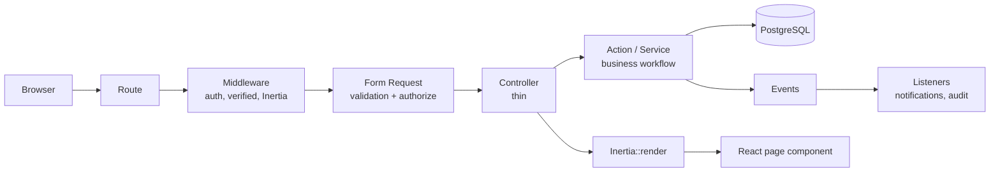

# Architecture

## Stack

Laravel 13 with Inertia.js v3 and React 19 in TypeScript, styled with Tailwind CSS v4 and
shadcn/ui, charts by Recharts, icons by Lucide. PostgreSQL in production and development;
SQLite in memory for tests. Authentication is Laravel Fortify via the official React
starter kit. Authorization is spatie/laravel-permission.

There is no separate API project and no standalone React app: React is served through
Inertia from the same Laravel application, so routing, validation, and authorization stay
in one place.

## Request flow

## Layering

**Controllers are thin.** They authorize, hand validated input to an action, and render.
Anything with more than one step lives in `app/Actions`:

- `Employees\CreateEmployee`, `Employees\GenerateEmployeeNumber`
- `Leave\SubmitLeaveRequest`, `Leave\ReviewLeaveRequest`, `Leave\CancelLeaveRequest`
- `Attendance\RecordAttendance`, `Attendance\CorrectAttendance`,
  `Attendance\SubmitAttendanceCorrection`, `Attendance\ReviewAttendanceCorrection`
- `Payroll\GeneratePayrollPeriod`, `Payroll\CalculateEmployeePayroll`
- `Documents\StoreEmployeeDocument`
- `Audit\WriteAuditLog`

**Form Requests own validation and authorization.** Rules live next to the endpoint they
guard, and `authorize()` delegates to a policy.

**Enums replace magic strings.** Sixteen backed enums in `app/Enums` carry `label()` and,
where useful, `badge()` and domain predicates such as
`AttendanceStatus::isExcused()`, `LeaveSession::dayFraction()`, and
`PayrollPeriodStatus::allowsRecalculation()`. Model casts mean an enum arrives as an enum,
not a string — which is exactly how a real comparison bug got caught during development.

**Transactions and locks** wrap every state change that touches a balance or a sequence:
employee creation, leave submit/approve/reject/cancel, balance adjustment, attendance
correction, payroll generation and publication.

## Why no repository layer

Eloquent already is the data-access abstraction. A repository wrapping it would add a
second vocabulary for the same queries, break eager loading and scopes, and buy nothing —
the application has one database and no plausible second implementation. Query reuse is
handled where it belongs: model scopes (`Employee::currentlyEmployed()`,
`Announcement::visible()`) and dedicated report methods.

Similarly avoided: CQRS, event sourcing, generic workflow engines, and microservices. The
leave approval is one level deep by design and is structured so a second level could be
added, without paying today for a generality nobody has asked for.

## Frontend

Pages live in `resources/js/pages`, mapping to `Inertia::render()` names. Wayfinder
generates typed route helpers under `@/routes` and `@/actions`, so URLs are not
hand-concatenated in React.

Validation is server-authoritative. Frontend checks exist for immediate feedback only;
every rule is re-applied on the backend, and Inertia surfaces the backend errors.

Theme (light/dark/system) persists in a cookie read by `HandleAppearance` middleware, so
the server renders the correct theme on first paint.

## File security

Employee documents are never served from a public URL. The storage path is in the model's
`$hidden`, filenames are generated rather than taken from the upload, and every download
goes through an authorized controller action that re-checks the policy. Visibility is a
first-class enum: `hr_only`, `employee_and_hr`, `internal_profile`.

## Audit logging

`Audit\WriteAuditLog` is the single writer. It redacts a fixed list of sensitive keys
(passwords, bank accounts, salaries, tokens, 2FA secrets) recursively before anything is
persisted, so an audit entry can never become the leak it was meant to detect.

## Domain events

Actions raise events after their transaction commits; listeners handle the secondary work.
This is what keeps a notification failure from rolling back a leave balance that was
already reserved.

| Event | Listeners |
| --- | --- |
| `EmployeeCreated` | audit |
| `LeaveRequestSubmitted` | audit, notify approvers |
| `LeaveRequestReviewed` | audit, notify employee |
| `LeaveRequestCancelled` | audit, notify employee if cancelled by someone else |
| `AttendanceCorrected` | audit, with before/after values |
| `PayrollPublished` | audit |
| `AnnouncementPublished` | audit |

`RecordDomainAudit` is the single audit writer and redacts salaries, bank accounts, tax
numbers, tokens, and secrets before persisting. Registration is explicit in
`EventServiceProvider`, so the whole "what happens when X occurs" map reads in one place.

## Queues and the scheduler

Notifications are Laravel database notifications, queued where the work is secondary.
Critical state changes complete inside their transaction; only the notification is
deferred, so a stopped queue worker never leaves a leave request half-approved.

The database queue driver is the default, which keeps local setup to zero extra services.

Scheduled commands, all idempotent by construction:

- `nusahr:process-absences {date?}`
- `nusahr:publish-announcements`
- `nusahr:notify-expiring-documents`

## Error handling

HTTP 403, 404, 419, 500, and 503 render through an Inertia `error` page so users stay
inside the application shell. In local development, non-403/404 responses fall through to
Laravel's own handler so stack traces remain available.

## Known gaps

The following PRD items are not yet implemented and are listed honestly rather than
claimed: PDF payslip export (the payslip page is print-styled instead), and
geolocation-based attendance (the location columns exist but nothing enforces them).
