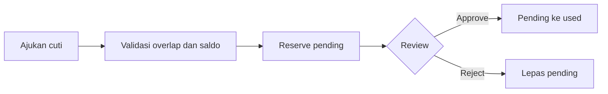
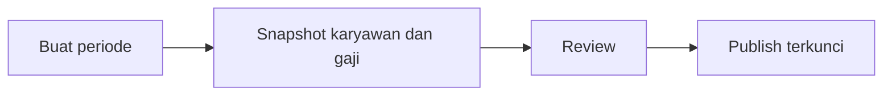

# Business rules

- Nomor dan akun karyawan unik; master data nonaktif tidak boleh dipilih.
- Hari kerja mengecualikan akhir pekan dan hari libur. Pengajuan overlap atau melebihi saldo ditolak. Pending balance direservasi dan dipindah ke used hanya setelah approval.
- Check-in hanya sekali sehari; check-out memerlukan check-in dan menghitung durasi. Proses absen melewati weekend, holiday, dan approved leave.
- Payroll membuat snapshot gaji agar perubahan historis tidak mengubah payslip. Hanya periode published terlihat oleh employee.

