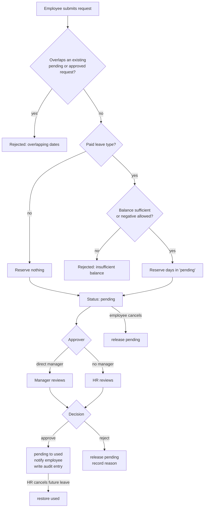
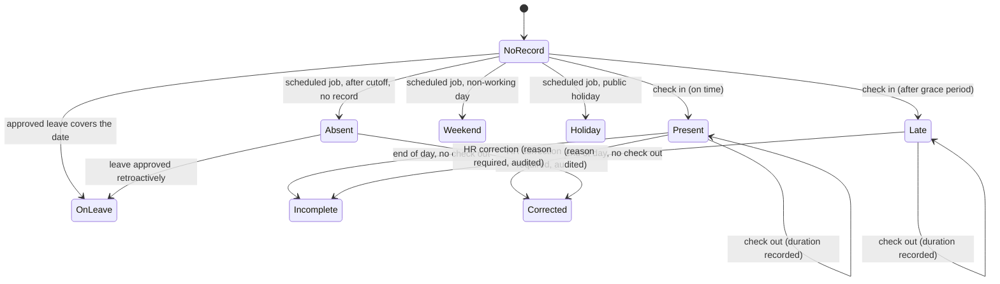
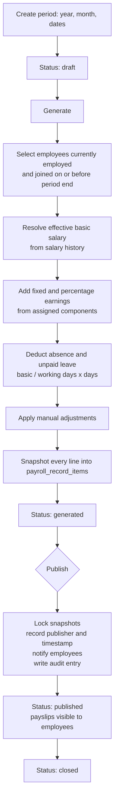

# Business rules

Payroll and leave rules here are **configurable demonstration defaults**. Statutory
entitlements and tax law vary by jurisdiction; this application models neither.

## Employee lifecycle

An employee record is separate from the login identity. `users` answers "who can sign in",
`employees` answers "who works here". They are created together in one transaction
(`App\Actions\Employees\CreateEmployee`), so a failure part-way through never leaves an
orphan account.

Employee numbers follow `EMP-{year}-{sequence}`, e.g. `EMP-2026-0001`, restarting each
year. The generator returns a *candidate*; uniqueness is enforced by the unique index, and
the create action retries on violation. A number supplied manually by HR is never
auto-renumbered — a collision there is a validation error, not a race.

Employment statuses: `active`, `probation`, `on_leave`, `suspended`, `resigned`,
`terminated`. The first three count as currently employed for headcount, payroll
eligibility, and absence processing.

Employees with transactional history are never deleted. Deactivation sets `ended_at`,
marks the user inactive (blocking login), and clears `manager_id` on their direct reports.

## Manager hierarchy

An employee may report to another employee. Three things are rejected:

1. Reporting to yourself.
2. Reporting to anyone in your own subtree (`Employee::wouldCreateReportingCycle()`).
3. Silently orphaning reports — deactivation detaches them explicitly.

Subtree walking is done in PHP over a shallow tree rather than a recursive CTE, because
the test suite runs on SQLite and the depth is a handful of levels.

## Leave

### Working-day calculation

Working days exclude weekends and active public holidays (`App\Services\WorkingDayCalculator`).
Half days are supported through `start_session` and `end_session`
(`full_day`, `first_half`, `second_half`); a half session consumes 0.5 days.

### Balance model

`remaining = entitled + carried_forward + adjustment − used − pending`

`remaining` is derived, never stored, so it cannot drift from its parts. Submitting a
request moves days into `pending`; approval moves them from `pending` to `used`; rejection
or cancellation releases `pending`. Cancelling an already-approved future request restores
`used`. Every one of those transitions runs inside a transaction with the balance row
locked.

### Approval workflow

Rules enforced server-side regardless of what the UI allows:

- Start date must not be after end date.
- Overlapping pending or approved requests for the same employee are refused.
- Leave types marked `requires_attachment` must have one.
- Approvers cannot approve their own request.
- Managers may only act on requests from their own reports.
- A request already decided cannot be decided again.

## Attendance

### State transitions

Rules:

- One attendance record per employee per date, guaranteed by a composite unique index.
- No second check-in without a check-out; no check-out before a check-in.
- Late minutes are measured from the company start time plus its grace period.
- Employees cannot edit raw timestamps. HR corrections require a reason and are audited
  with old and new values.
- Weekends, holidays, and approved leave are recorded explicitly so they can never be
  mistaken for unexplained absence.

### Correction requests

Employees cannot edit raw timestamps, but a failed badge reader still has to be reportable.
`attendance_corrections` records what was asked for; **nothing on the attendance row
changes until HR approves**.

- One pending request per attendance record — a second is refused while one is open.
- An employee may only raise a request against their own record.
- Reviewing requires `attendance.correct`, so nobody can approve their own request.
- A decided request cannot be decided again.
- Approval applies the values through the same `CorrectAttendance` action as a direct HR
  edit, so it lands in the audit trail by exactly one route.

### Daily absence processing

`php artisan nusahr:process-absences {date?}` is idempotent. It marks missing check-outs as
`incomplete` and creates `absent` (or `leave`) rows only where no record exists. Running it
twice for the same date changes nothing, which is what makes it safe to schedule and to
re-run by hand.

## Payroll

### Calculation

Default daily rate: **basic salary ÷ configured working days in the period**.

Rules:

- One period per year and month, enforced by a unique index on the date range.
- Generation and recalculation are allowed only in `draft`, `generated`, or `failed`.
  `published` and `closed` periods are frozen.
- Recalculation is deterministic: the same inputs always produce the same figures.
  Computed items are wiped and rebuilt; manual adjustments are kept in a separate table so
  a recalculation cannot destroy them.
- Employees see a payslip only once its period is published or closed.
- Publication is transactional.

## Leave calendar

Three scopes, and the one a user receives is derived from their role rather than taken
from the query string: an employee requesting `company` is served their own calendar, not
everyone's.

| Role | Available scopes |
| --- | --- |
| Employee | personal |
| Manager | personal, team (their reporting subtree) |
| HR / Super Admin | personal, team, company |

The calendar payload carries only dates, type, and employee identity. **Leave reasons are
excluded from the query entirely** — they are confidential and there is no view in which
one employee needs to read another's.

## Announcement audience

`audience_type` decides how `announcement_audiences` is read:

- `all` — no targeting rows; everyone sees it.
- `departments`, `employment_types`, `employees` — the polymorphic rows list the targets.

Only `published` announcements with a `published_at` in the past and no elapsed
`expires_at` are visible to employees. Drafts, scheduled, and archived items never appear
in the employee feed. `php artisan nusahr:publish-announcements` promotes scheduled items
whose time has come, and is idempotent.

## Sensitive data

These employee fields are hidden by default on the model and only unhidden after an
explicit policy check: basic salary, bank name and account, account holder, tax number,
personal email, home address, emergency contact, and private notes.

By default **managers cannot see compensation for anyone**, including their own reports.
Position salary bands are hidden for the same reason. Employees see their own sensitive
data and nobody else's.
