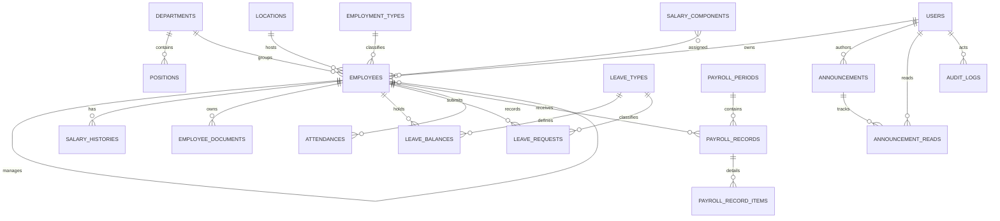

# Database design

## Main entities and constraints

Users own at most one employee profile. Departments own positions; employees reference active organization master data and optionally another employee as manager. The application rejects self/circular manager assignments. Employee number and user email are unique. Salary history is effective-dated and payroll records preserve immutable period snapshots.

Leave balance is unique per employee, leave type, and year. Pending requests reserve balance; approval transfers reserved days to used, while rejection/cancellation restores it. Attendance is unique per employee and date. Payroll periods are unique by date range and records by period/employee. Announcement reads and employee component effective dates also have composite unique constraints.

Money uses `decimal(15,2)` in PostgreSQL and is rounded at payroll item boundaries. Historical payroll and leave records use restrictive foreign keys where deleting master data would corrupt history. Aggregate-owned items, reads, balances, and documents cascade only with their owning record. Operational tables include indexes for status, dates, managers, audience publication, expiration, and polymorphic audit lookup.

Private file records store generated paths and metadata, never public URLs. Audit metadata is JSON with sensitive keys redacted. Bank accounts use an encrypted Eloquent cast and are hidden from serialization.

