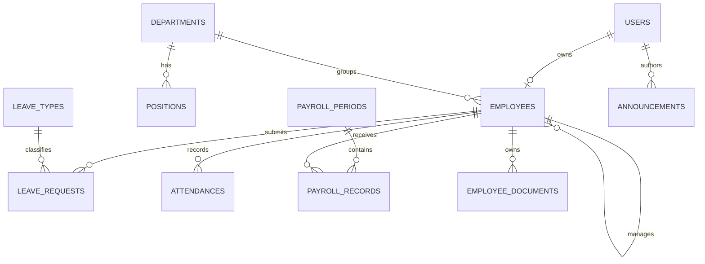

# Desain database

Nilai uang memakai `decimal(15,2)`. Foreign key menggunakan restrict untuk master data bersejarah dan cascade hanya untuk aggregate-owned data. Unique constraints melindungi nomor karyawan, satu presensi per hari, satu saldo per tahun/jenis, periode payroll, dan satu record payroll per karyawan.

