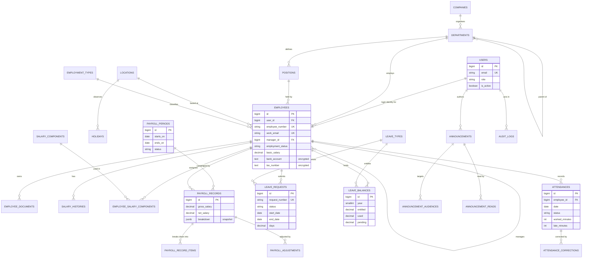

# Database design

PostgreSQL is the target database. SQLite is used for the automated test suite, so the
schema deliberately avoids PostgreSQL-only column types in places the tests exercise.

## Entity relationship diagram

Framework tables (sessions, cache, jobs, notifications, Spatie permission tables) are
omitted; the diagram shows the HR domain.

## Key constraints

Uniqueness that matters is enforced by the database, not only by application checks —
application checks exist to produce friendly messages, but only an index survives a race.

| Constraint | Prevents |
| --- | --- |
| `employees.employee_number` unique | Duplicate employee numbers under concurrent creation |
| `employees.work_email` unique | Two records claiming the same work address |
| `attendances (employee_id, date)` unique | Two attendance rows for one person on one day |
| `leave_balances (employee_id, leave_type_id, year)` unique | Divergent balances for the same entitlement |
| `payroll_periods (starts_on, ends_on)` unique | Two payroll runs covering the same month |
| `payroll_records (payroll_period_id, employee_id)` unique | Paying someone twice in a period |
| `announcement_reads (announcement_id, user_id)` unique | Inflated readership counts |
| `announcement_audiences (announcement_id, type, id)` unique | Duplicate targeting rows |

## Indexing decisions

Indexes follow the access patterns the application actually has, rather than being added
to every column:

- `employees`: `employment_status`, `(department_id, employment_status)`, `manager_id`,
  `contract_ends_on`, `probation_ends_on` — dashboards filter by status and department,
  reports scan expiring contracts, and manager scoping walks `manager_id`.
- `attendances`: `(date, status)` for the daily overview and the 30-day trend chart.
- `leave_requests`: `(employee_id, status)` and `(status, start_date)` for personal history
  and the approval queue.
- `payroll_periods`: `(status, ends_on)` for "latest published period".
- `audit_logs`: `(user_id, created_at)` and `(event, created_at)` for the filtered viewer.
- `announcements`: `(status, published_at)` for the employee feed.

## Money handling

All monetary columns are `decimal(15, 2)`; percentages on salary components are
`decimal(15, 4)`. Money never touches a float column. Payroll comparisons use `bccomp`
rather than `==` so a salary change is detected exactly.

## Historical snapshots

`payroll_record_items` copies the component name, type, and amount at generation time, and
`payroll_records.breakdown` stores a JSONB snapshot of the inputs. Editing a master salary
component later therefore cannot alter a payslip that has already been generated.

`salary_histories` keeps every basic-salary change with its effective date range, so payroll
for a past period uses the salary that applied then, not today's.

## Deletion strategy

Transactional HR history is never cascade-deleted:

- `restrict` on the uploader of a document and the creator of an adjustment — you cannot
  delete a user out from under records that attribute an action to them.
- `set null` on optional references such as `manager_id`, `location_id`, and audit actors,
  so removing a lookup row degrades the record rather than destroying it.
- `cascade` only where the child has no independent meaning: payroll items belong to their
  record, announcement audiences belong to their announcement.

Employees are never hard-deleted. Deactivation sets `ended_at`, flips the user to inactive,
and detaches direct reports; the employment status enum records *why* they left.
